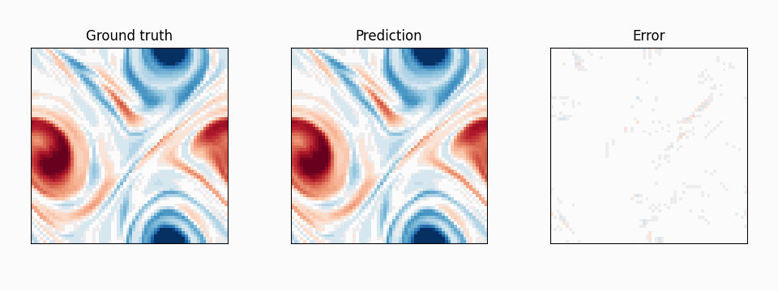

# Multi-Scale Wavelet Transformers (MSWT)

This project includes the implementation of our work: 
<u>["Multi-Scale Wavelet Transformers for Operator Learning of Dynamical Systems"](https://arxiv.org/abs/2602.01486)
</u>

Xuesong Wang, Michael Groom, Rafael Oliveira, He Zhao, Terence O'Kane, Edwin V. Bonilla (ICML 2026)

<p align="center">
  
</p>

Neural operator benchmarks and models for PDEs: 2D Navier–Stokes, Shallow Water, and ERA5 climate prediction. Supports FNO, Unet, WNO, SAOT,  HFS, MSWT (multiscale wavelet transformers).


---


## Installation

From the project root:

```bash
pip install -r requirements.txt
```

**On Virga (NCI):** load PyTorch before installing or running:

```bash
module load pytorch/2.5.1-py312-cu122-mpi
# then activate your env if you use one, e.g.:
# source $HOME/.venvs/pytorch/bin/activate
pip install -r requirements.txt
```

---

## Usage

From the project root, run a quick model + random-input test (uses the NS2D MSWT config for architecture and data shape):

```bash
python test_sanity_check.py
```

If dependencies and paths are correct, this prints the model parameter count, output shape, and `Sanity check passed.`

--- 

## Main folders

| Folder | Description |
|--------|-------------|
| **NS2D_ChaoticKolmogorovFlow** | 2D incompressible Navier–Stokes (chaotic Kolmogorov flow). Vorticity one-step prediction and autoregressive rollout; metrics include relative L², spectra, enstrophy. |
| **SW2D_PDA** | 2D Shallow Water from PDE Arena (vorticity + pressure); periodic and linear configs. |
| **ERA5** | Global atmospheric prediction from ERA5 on the sphere (LUCIE-style); one-step tendencies and long autoregressive rollout with climatology bias. |
| **data_generation/** | Scripts for generating or preprocessing PDE datasets. |
| **models/** | Shared operator architectures (FNO, WNO, SAOT, MSWT, PDERefiner, etc.). |
| **utils/** | Shared training utilities, criteria, diagnostics, grid helpers. |

Each benchmark folder has its own `configs/`, `train_*`, `test_*`, and (where applicable) `post_processing_metric_table.py` and `readme.md`.

---